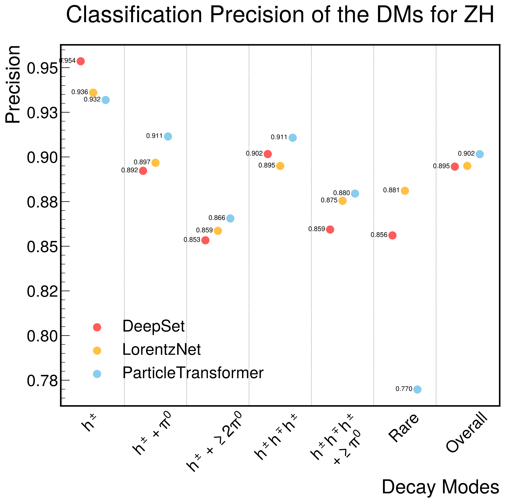

# End-to-end ML reconstruction and identification of hadronically decaying tau lepton.

The aim of this project is to develop and test end-to-end machine learning methods for reconstruction and identification of hadronically decaying tau lepton, while also providing a thouroughly validated and tested dataset for evaluating the performances of said algorithms.

    

Tau leptons can decay both leptonically and hadronically, however only hadronic decays are targeted with this project:

    

## Future Dataset 

The dataset contains 2 signal samples (ZH->Ztautau and Z->tautau) and one background sample (Z->qq).
While the validation plots can be reproduced with [this script](notebooks/data_intro.ipynb), here is a selection of these: 

The generator-level hadronically decaying tau visible transverse momentum:

    

The jet substructure of two neutral-hadronless decay modes:

  

---
---

## Papers:
The results of these studies have been divided across two separate papers, with the first one covering tau identification and the latter covering both kinematic and decay mode reconstruction.

### TauID  

**"Tau lepton identification and reconstruction: a new frontier for jet-tagging ML algorithms"**

*[Published in: Comput.Phys.Commun. 298 (2024) 109095]*

In this paper, we studied the performance of state-of-the-art methods and compared them with the ML architectures initially designed for jet-tagging.

  

---

### Tau reconstruction 
**"A unified machine learning approach for reconstructing hadronically decaying tau leptons"**

Here we demonstrated how three different types of models with a varying degree of expressiveness and priors can be employed for hadronically decaying tau kinematic reconstruction and decay mode reconstruction.

  

  