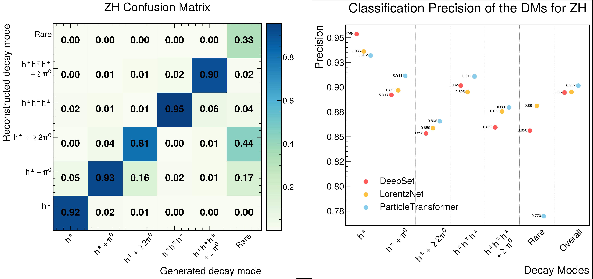
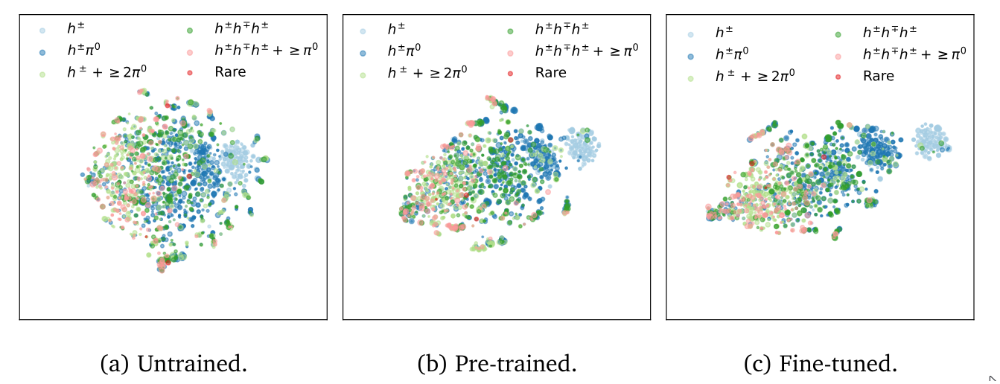

# Machine learned reconstruction and identification of hadronically decaying tau lepton.

The aim of this project is to develop and test end-to-end machine learning methods for reconstruction and identification of hadronically decaying tau lepton, while also providing a thouroughly validated and tested dataset for evaluating the performances of said algorithms.

Tau leptons can decay both leptonically and hadronically, however only hadronic decays are targeted with this project:

---

---

# Papers:

The results of these studies have been divided across two separate papers, with the first one covering tau identification and the latter covering both kinematic and decay mode reconstruction.

## TauID  

**"Tau lepton identification and reconstruction: a new frontier for jet-tagging ML algorithms"**

_[Published in: Comput.Phys.Commun. 298 (2024) 109095]_

In this paper, we studied the performance of state-of-the-art methods and compared them with the ML architectures initially designed for jet-tagging.

---

## Tau kinematic and decay mode reconstruction  

_[Published in: Comput.Phys.Commun. 307 (2025) 109399]_

**"A unified machine learning approach for reconstructing hadronically decaying tau leptons"**

Here we demonstrated how three different types of models with a varying degree of expressiveness and priors can be employed for hadronically decaying tau kinematic reconstruction and decay mode reconstruction.

---

## Tau reconstruction and identification using a foundation model  

_[Published in: SciPost Phys. Core 8, 046 (2025)]_

**"Reconstructing hadronically decaying tau leptons with a jet foundation model"**

In this paper we demonstrate how a jet foundation model, Omnijet-alpha, can successfully be utilized for a out-of-domain and out-of-context tasks such as hadronically decaying tau lepton identification, kinematic reconstruction and decay mode classification.

