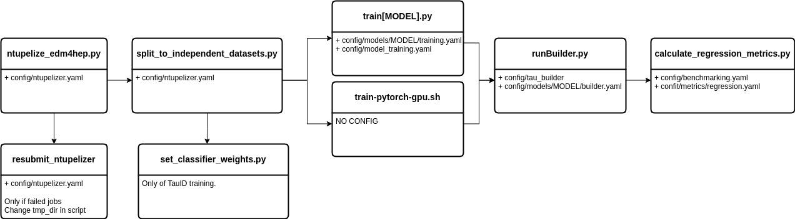

## Training model on GPU

The input data files for the training should be located either in `/scratch/persistent` or `/home` and **NOT** in `/local` as the loading from `/local` takes too long.

## Scripts

- **calculate_regression_metrics.py** - for producing the result plots for the regression task
- **ntupelize_edm4hep.py** - processes the input Key4HEP .root files into the input files used for the ML training
- **resubmit_ntupelizer.py** - sometimes some ntupelizing jobs fail. This script resubmits those jobs.
- **runBuilder.py** - script used for producing the ntuples containing the predicted tau info.
- **set_classifier_weights.py** - sets weights to the signal and background samples into the ntuples. Needed only for tauID task.
- **split_to_independent_datasets.py** - does the train-val-test split for all input files
- **submit_builder_batchJobs.sh** - executes all slurm submission scripts.
- **train-pytorch-gpu.sh** - script used to submit the ML training to GPU queue
- **train[LorentzNet/ParticleTransformer/SimpleDNN]** - training scripts for the respective models.

